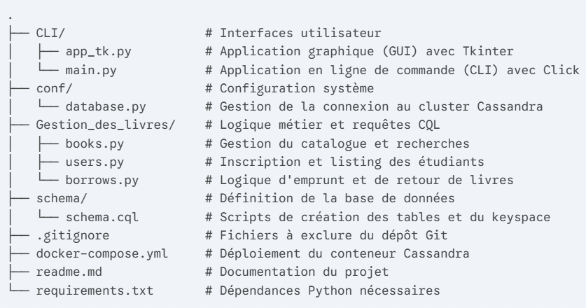

# 📚 Library Management System - Cassandra & Python GUI

Ce projet est une application complète de gestion de bibliothèque universitaire conçue pour démontrer la puissance de **Apache Cassandra** combinée à une interface **Python Tkinter**. 

L'application gère plus de **15 000 données** (livres et étudiants) avec des performances de recherche instantanées.

---

## 🎯 Objectifs du Projet
* Déployer une base de données NoSQL distribuée (**Cassandra**) via Docker.
* Modéliser les données selon les principes de dénormalisation (Query-First Design).
* Développer une interface graphique (GUI) intuitive pour les bibliothécaires.
* Gérer les flux d'emprunts et les statistiques en temps réel.

---

## 📦 Architecture Technique




### 1️⃣ Infrastructure (Docker)
Le projet utilise **Docker Compose** pour garantir un environnement reproductible sans dépendances locales complexes.
* **Cassandra 4.1** : Moteur de base de données.
* **Ports utilisés** : 
    * `9042` : Cassandra (Communication Python).
    * `9160` : CQL Web Editor (Interface d'administration).

### 2️⃣ Base de données (CQL)
La modélisation est optimisée pour la lecture :
* `book_by_isbn` : Recherche rapide par identifiant unique.
* `books_by_author` / `books_by_category` : Tables dénormalisées pour le filtrage.
* `global_stats` : Utilisation des types `counter` pour les statistiques globales.

### 3️⃣ Application (Python)
* **Driver Cassandra** : Pour les requêtes asynchrones et les Batch Statements.
* **Tkinter** : Interface utilisateur riche.
* **Tabulate & Colorama** : Pour les outils de diagnostic en CLI.

---

## 🛠️ Installation et Lancement

### Prérequis
* Docker & Docker Compose
* Python 3.10+

### Étapes clés
```bash
docker-compose up -d

pip install -r requirements.txt
python scripts/generate_data.py

python app_bibliotheque.py

---

Cloner le projet : `git clone https://github.com/mzarrouk18/Library-Management-NoSQL.git`
